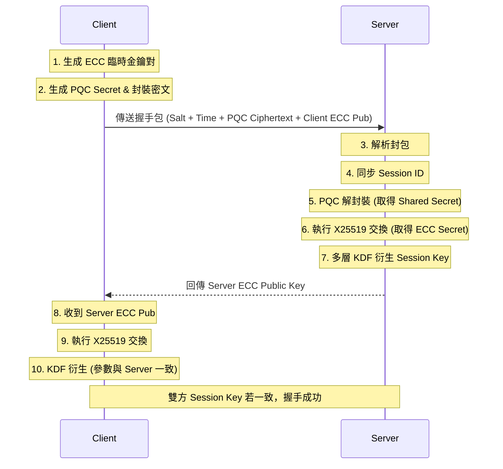

# 🛡️ Quantum-Secure Hybrid Communication System

### 量子安全混合加密通訊系統 (Hybrid KEM + AES-GCM)

> **專案核心目標**：實作一個抗量子電腦攻擊的混合密鑰封裝機制 (Hybrid KEM)，結合傳統橢圓曲線 (ECC) 與後量子密碼學 (PQC) 的優勢，建立具備前向保密性 (PFS) 與完整性驗證 (Integrity) 的安全通訊通道。

---

## 🏗 專案架構與設計理念

本系統採用 **Client-Server 架構**，核心邏輯與介面分離，確保系統的可維護性與擴充性。

### 核心模組層級

1. **Core Kernel (`innovative_hybrid_kem.py`)**：
* 系統的「大腦」。封裝了所有的密碼學原語 (Primitives)。
* 無狀態設計 (Stateless)，僅負責輸入數據 -> 輸出加密結果。
* 包含：ECC 金鑰生成、PQC 模擬封裝、多層 KDF 衍生、AES-GCM 加解密。


2. **Controller Layer (`server.py`, `client.py`)**：
* 負責網路 Socket 連線管理、封包收發、以及 Session ID 的狀態同步。


3. **Presentation Layer (`gui_server.py`, `gui_client.py`)**：
* 視覺化介面。
* Server 端：駭客風格監控儀表板，即時顯示攔截到的 IV、Tag 與密文。
* Client 端：使用者聊天視窗，提供一鍵握手與加密發送功能。

---

## 🛠 核心技術堆疊

| 組件 | 技術選擇 | 用途與設計理由 |
| --- | --- | --- |
| **PQC (後量子)** | **Kyber-768 (Simulated)** | 模擬 NIST 標準化之晶格密碼學，抵抗量子電腦攻擊。(本專案為邏輯驗證，暫以高熵隨機數模擬) |
| **ECC (傳統)** | **X25519 (Curve25519)** | 使用 `cryptography` 庫。提供高效的密鑰交換，作為 PQC 的保險 (Hybrid 策略)。 |
| **KDF (金鑰衍生)** | **HKDF-SHA3** | 使用 SHA3-512 與 HMAC 建構多層衍生函數，確保金鑰的隨機性與抗碰撞性。 |
| **加密傳輸** | **AES-256-GCM** | 軍規級對稱加密。GCM 模式同時提供**機密性 (Confidentiality)** 與 **完整性 (Integrity)**，防止中間人篡改封包。 |
| **通訊協定** | **TCP Socket** | 自定義應用層協定，包含 Header (長度) 與 Payload (JSON/Binary)。 |

---

## 🔄 系統流程圖

### 1. 混合密鑰握手 (Handshake Protocol)



### 2. 安全訊息傳輸 (Secure Messaging)

1. **Client 加密**：
* 生成 12 bytes 隨機 `IV`。
* 使用 `Session Key` 執行 `AES-GCM` 加密 -> 產出 `Ciphertext` 與 `Tag`。
* 封包內容：`{ "iv": hex, "ciphertext": hex, "tag": hex }`。


2. **Server 解密**：
* 提取 `IV` 與 `Tag`。
* 執行 `AES-GCM` 解密並驗證 Tag。
* 若 Tag 驗證失敗 (代表被篡改)，拒絕解密；成功則顯示明文。


---

## 🚀 安裝與執行

### 環境需求

* Python 3.10+
* 必要的 Python 套件：
```bash
pip install cryptography

```


### 啟動步驟

1. **啟動監控伺服器**：
開啟終端機，執行：
```bash
python network/gui_server.py

```


*等待 "監聽 127.0.0.1:8888" 訊息出現。*
2. **啟動用戶端**：
開啟第二個終端機，執行：
```bash
python network/gui_client.py

```


3. **執行握手**：
* 點擊 Client 介面的 **"1. 執行混合金鑰握手"**。
* 觀察 Server 介面顯示握手成功，並比對雙方黃色字體的 `Session Key` 前 16 碼是否一致。


4. **發送加密訊息**：
* 輸入訊息並點擊 **"2. 加密並發送"**。
* Server 介面將顯示攔截到的密文，並自動解密出原始訊息。


---

## 🧠 技術細節與工程決策 (Engineering Decisions)

### Q1: 為什麼要使用「混合 (Hybrid)」加密？

單純使用 PQC 演算法 (如 Kyber) 雖然抗量子，但在傳統電腦上的實作歷史較短，可能潛藏未被發現的數學漏洞。結合成熟的 ECC (X25519) 可以確保**「即使 PQC 被攻破，傳統安全性依然存在」**的縱深防禦效果。

### Q2: 為什麼選擇 AES-GCM 而不是 CBC？

AES-CBC 模式容易受到 Padding Oracle 攻擊，且不具備內建的完整性驗證。GCM (Galois/Counter Mode) 是一種 **AEAD (Authenticated Encryption with Associated Data)** 模式，它在加密的同時生成 Authentication Tag。如果中間人修改了密文的一個位元，Tag 驗證就會失敗，系統會直接丟棄封包，從而防止密文篡改攻擊。

### Q3: Session ID 與 Salt 的作用？

為了防止**重放攻擊 (Replay Attack)** 與**彩虹表攻擊**：

* **Session ID**：每次連線隨機生成，確保每條連線的上下文 (Context) 獨一無二。
* **Dynamic Salt**：結合公鑰與隨機數生成的鹽值，確保即使兩次會話使用相同的金鑰 (機率極低)，產生的最終 Session Key 也會完全不同。

---

## 🚧 限制與未來展望

### 當前限制 (Limitations)

1. **模擬 PQC**：目前的 `encapsulate_pqc` 與 `decapsulate_pqc` 為邏輯模擬 (使用隨機數交換)。在生產環境中，需替換為 `liboqs-python` 或 `pyoqs` 以執行真實的 Kyber 數學運算。
2. **時間混淆 (Bypass)**：為了確保分散式環境下的穩定性，目前的「時間混淆層」處於 Pass-through 模式。未來需引入 NTP 校時機制才能開啟。

### 未來路線圖 (Roadmap)

* [ ] **整合真實 PQC 庫**：引入 `liboqs` 實作真實 Kyber-768。
* [ ] **雙向認證**：實作數位簽章 (Dilithium 或 ECDSA) 以驗證 Client/Server 身分。
* [ ] **持久化熵池**：建立安全的熵同步機制。

---

> **Author**: [你的名字]
> **Date**: 2025-12-28
> **Note**: 本專案為資工系系統設計與密碼學實作之原型驗證 (PoC)。