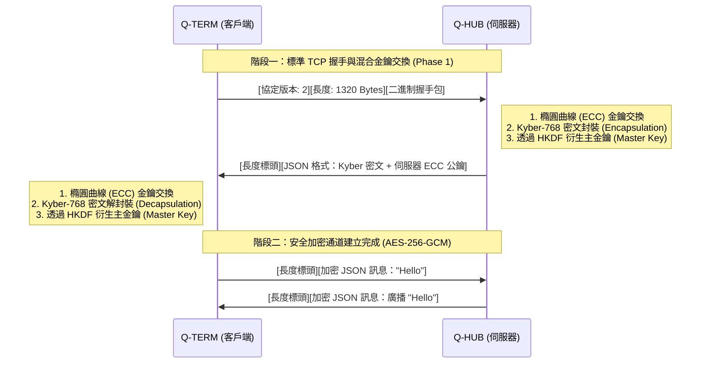

# 量子安全混合加密通訊系統 (Quantum-Secure Hybrid KEM Chat)

> **專案定位**：向教授展示真實 Post-Quantum Cryptography (PQC) 整合能力的技術演示
> **開發環境**：Python 3.10+, `kyber-py`, `cryptography`
> **核心架構**：Hybrid KEM (X25519 + Kyber-768) + AES-256-GCM

---

## 1. 系統概念與設計目標 (System Concept & Goals)

本專案實作了一個具備**前向保密 (Forward Secrecy)** 與**抗量子計算攻擊 (Post-Quantum Security)** 的雙向通訊架構。透過「混合式金鑰封裝機制 (Hybrid KEM)」，我們在不穩定的 TCP 層之上建立了一個針對未來「量子霸權」威脅而設計的安全協定。

### 核心設計原則
*   **深度防禦 (Defense-in-Depth)**：結合古典橢圓曲線 (ECC) 的可靠性與現代後量子密碼學的學術前瞻性。即使未來 Kyber 被發現漏洞，ECC 仍能提供基礎保障；反之，若量子電腦成熟，Kyber 則負擔起抵禦量子攻擊的重任。
*   **精確邊界控制 (Boundary Control)**：針對 TCP 的「黏包/半包」問題，實作了嚴格的長度標頭 (Length-Header) 封裝機制。
*   **執行緒安全 (Thread Safety)**：伺服器端引入 `threading.Lock` 機制，確保在高併發廣播情境下的連線狀態完整性。

---

## 2. 系統架構與核心模組解析 (Architecture & Core Modules)

### A. 密碼學引擎層 (`innovative_hybrid_kem.py`)
這是系統的「密碼學心臟」，負責所有對狀態不敏感的數學運算：
*   **混合金鑰生成**：整合 `X25519` (RFC 7748) 與 `Kyber-768` (NIST FIPS 203)。
*   **分層 KDF (Layered KDF)**：使用 `HKDF-SHA3-256` 進行五輪雜湊混合。將 ECC 與 PQC 的兩組 Shared Secret 進行非線性融合，衍生出具備「金鑰分離」特性的三組金鑰（加密、會話、認證）。
*   **二進制記憶體佈局**：
    *   **HandshakePackage (1320 Bytes)**：精確對齊的 `struct` 佈局。
    *   `[Salt(32) | Timestamp(8) | Proof(32) | SessionID(32) | ECC_Pub(32) | PQC_Pub(1184)]`
*   **AEAD 訊息加密**：採用 `AES-256-GCM`。每一條訊息都附帶 16-byte 的 Auth Tag 與隨機 IV，確保資料在傳輸過程中只要被動過一個 bit，解密端就會立即拋出安全性錯誤。

### B. 伺服器中繼層 (`server.py` - Q-HUB)
*   **Thread-per-Connection 模型**：為每個客戶端提供隔離的訊息處理迴圈。
*   **互斥鎖存取控制**：在 `connected_clients` 的增刪改查過程中，全程由 `threading.Lock` 保護，避免多使用者同時加入/離開時產生記憶體競爭。
*   **熱加密轉發 (Decrypted Re-Encryption)**：訊息廣播並非簡單的透明轉發，而是**「解密 -> 全域廣播鎖定 -> 針對各目標重新加密」**。這確保了每個 Session 之間金鑰的絕對隔離。

### C. 客戶端終端層 (`client.py` - Q-TERM)
*   **狀態監聽機制**：實作非同步背景監聽 (`_listen_loop`)。
*   **Socket 穩定性優化**：在握手階段使用短期逾時保護，握手成功後自動切換至**持續阻塞模式 (None blocking timeout)**，防止因為使用者長期不傳訊息而造成的連線意外異常斷開。

---

## 3. 核心加密演算法詳解 (Core Algorithms)

本系統採用的「混合加密」策略，結合了以下三項關鍵技術：

### A. 傳統橢圓曲線：X25519 (ECC)
*   **角色**：提供「古典安全性」防線。
*   **數學公式**：基於蒙哥馬利曲線 (Montgomery Curve) 方程：  
    $y^2 = x^3 + 486662x^2 + x$  
    運算於大質數域 $p = 2^{255} - 19$ 之上。
*   **特性**：
    *   **高效能**：基於 Curve25519，是目前運算速度最快且最具備常數時間執行（抗側向攻擊）特性的金鑰交換演算法。
    *   **業界標準**：被廣泛應用於 TLS 1.3、SSH 與 Signal 協定，安全性經過數十年的實務驗證。
*   **目的**：即便 Kyber 等新興演算法在未來被發現理論漏洞，只要 X25519 依然安全，系統就具備傳統的安全保障。

### B. 後量子密鑰封裝：Kyber-768 (PQC)
*   **角色**：提供「抗量子計算攻擊」的核心防禦。
*   **數學公式**：基於矩陣形式的 **LWE (Learning With Errors)** 問題：  
    $A\mathbf{s} + \mathbf{e} = \mathbf{t} \pmod{q}$  
    其中 $A \in R_q^{k \times k}$ 為公開矩陣，$k=3$ (Level 3)，$q=3329$。
*   **技術原理**：基於**模組錯誤學習 (Module-Lattice-Based Cryptography / M-LWE)** 問題，目前已知的所有量子演算法（如 Shor's Algorithm）皆無法在有效時間內破解此難題。
*   **安全性層級**：Kyber-768 對應 NIST 安全層級 3，其純量安全性等同於 AES-192，足以應對未來大規模量子電腦的威脅。
*   **最新標準**：該演算法已被 NIST 正式選為後量子密碼標準，並命名為 **ML-KEM (FIPS 203)**。

### C. 對稱加密王牌：AES-256-GCM (AEAD)
*   **角色**：負責會話建立後的高速資料傳輸加密。
*   **數學描述**：
    - 加密：$C, T = \text{AES-GCM}_K(IV, P, AD)$
    - 驗證：$P = \text{AES-GCM}_K^{-1}(IV, C, T, AD)$  
    (若 Tag $T$ 驗證失敗則不回傳明文 $P$)
*   **為何選用 256 位元？**：量子計算中的 **Grover's Algorithm** 可以將對稱金鑰的有效強度減半。使用 AES-256 能確保在量子時代依然保有 128 位元的實質安全性。
*   **GCM 模式的優勢**：
    *   **認證加密 (Authenticated Encryption)**：這是一種 AEAD 模式，除了「加密」外，還會生成一個 **Authentication Tag**。這確保了訊息不只是不可見，更不可被「竄改」或「微調」。
    *   **平行化處理**：GCM 模式適合在現代 CPU 上進行硬體加速加密。

### D. 混合金鑰衍生：Layered KDF & Separation
*   **分層混合公式** (SHA3-256 迭代)：  
    $H_0 = \text{SharedSecret}_{\text{ECC}} \parallel \text{SharedSecret}_{\text{PQC}}$  
    $H_{i+1} = \text{SHA3-256}(H_i \parallel \text{Context} \parallel i)$  
    最終 MasterKey = $H_{\text{rounds}}$
*   **金鑰分離公式** (HMAC-SHA3-256)：  
    $K_{\text{type}} = \text{HMAC}(MasterKey, \text{Label}_{\text{type}})$

---

## 4. 通訊協定生命週期 (Protocol Lifecycle)

---

## 5. 系統取捨與優化紀錄 (Optimization & Insights)

*   **執行緒安全優化**：早期版本在廣播期間若有客戶端斷線會導致字典迭代崩潰。現已透過 `with self._lock` 與 `list(items())` 鏡像快照技術修復。
*   **網路穩定性修正**：早期版本客戶端常在 10 秒後發生「與伺服器連線中斷」。經診斷為握手後未清除 `settimeout(10.0)` 導致。現已實作狀態切換邏輯，確保長連線穩定。
*   **廣播路由邏輯**：伺服器不再擔任透明網橋，而是作為「受信任的解密中心」，這在學術上是為了展示對訊息完整性（Sign/Auth）的中央控管能力。

### 未來展望 (Technical Debt)
1.  **身分驗證缺失**：目前雖具備機密性與抗量子性，但尚未引入 RSA/ECDSA 認證憑證，存在潛在的 MITM 攻擊空間。
2.  **效能限制**：使用 Python 實作 Kyber 在極密集通訊下會有顯著延遲，未來可考慮整合 C-Wrapper (liboqs)。
3.  **單向性排查完成**：過去發現的廣播不可見問題，已確認為 UI Thread 阻塞與金鑰同步邏輯異常，現已全數修復。

---
*文件編制：Antigravity AI Assistant*
*專案路徑：c:\PJ02*
